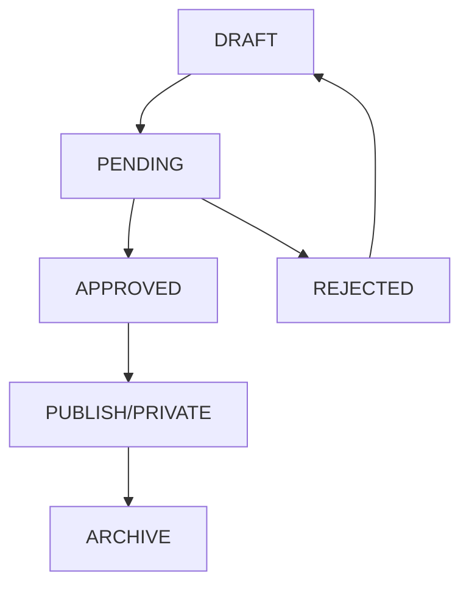

# Arsitektur Aplikasi Humanika

Dokumentasi lengkap mengenai arsitektur, struktur, dan komponen sistem Humanika.

## 🏗️ Arsitektur Overall

Humanika dibangun dengan arsitektur **Full-Stack Modern** menggunakan teknologi terkini:

```
┌─────────────────┐    ┌─────────────────┐    ┌─────────────────┐
│   Frontend      │    │   Backend       │    │   Database      │
│   (Next.js)     │◄──►│   (Next.js API) │◄──►│   (MongoDB)     │
│                 │    │                 │    │                 │
│ • React 18      │    │ • API Routes    │    │ • Prisma ORM    │
│ • TypeScript    │    │ • NextAuth.js   │    │ • Schema Models │
│ • Tailwind CSS  │    │ • Google APIs   │    │ • Indexing      │
└─────────────────┘    └─────────────────┘    └─────────────────┘
```

## 📁 Struktur Project

```
humanika/
├── app/                          # Next.js App Router
│   ├── (admin)/                  # Admin routes (protected)
│   ├── (public)/                 # Public routes
│   ├── api/                      # API routes
│   ├── auth/                     # Authentication pages
│   └── docs/                     # Documentation pages
├── components/                   # React components
│   ├── admin/                    # Admin-specific components
│   ├── public/                   # Public components
│   ├── ui/                       # Reusable UI components
│   └── MDXComponents.tsx         # MDX rendering components
├── docs/                         # Documentation (MDX files)
├── hooks/                        # Custom React hooks
├── lib/                          # Utility libraries
├── prisma/                       # Database schema & migrations
├── services/                     # Business logic services
├── types/                        # TypeScript type definitions
└── use-cases/                    # Application use cases
```

## 🗄️ Database Schema

### Model Utama

| Model           | Deskripsi                | Relasi Utama                    |
| --------------- | ------------------------ | ------------------------------- |
| **User**        | Data pengguna sistem     | Management, Articles, Finances  |
| **Period**      | Periode kepengurusan     | Management, Events, Finances    |
| **Management**  | Jabatan manajemen        | User, Period                    |
| **WorkProgram** | Program kerja departemen | Period, Events, DepartmentTasks |
| **Event**       | Kegiatan & acara         | Period, WorkProgram, Galleries  |
| **Document**    | File dokumen             | Event, Letter, DocumentType     |
| **Finance**     | Transaksi keuangan       | Period, Event, FinanceCategory  |
| **Article**     | Konten artikel           | User, Period, ArticleCategory   |
| **Letter**      | Surat masuk/keluar       | User, Period, Event             |
| **Approval**    | Sistem persetujuan       | Semua entity                    |

### Enums & Konstanta

```typescript
// User Roles Hierarchy
enum UserRole {
  DPO       // Dewan Pengurus Organisasi (Highest)
  BPH       // Badan Pengurus Harian
  PENGURUS  // Pengurus Departemen
  ANGGOTA   // Anggota Biasa (Lowest)
}

// Entity Status
enum Status {
  DRAFT     // Draft, editable
  PENDING   // Waiting for approval
  PUBLISH   // Public & active
  PRIVATE   // Not public but active
  ARCHIVE   // Archived, not active
}

// Approval Status
enum StatusApproval {
  PENDING   // Waiting for approval
  APPROVED  // Approved
  REJECTED  // Rejected
  CANCELLED // Cancelled by user
}
```

## 🔐 Sistem Authentication & Authorization

### Authentication Flow

```
1. User Login → Google OAuth → NextAuth.js
2. JWT Token Generation → Session Management
3. Role-Based Access Control → Route Protection
4. Activity Logging → Audit Trail
```

### Role-Based Permissions

| Role         | Permissions                                      |
| ------------ | ------------------------------------------------ |
| **DPO**      | Full access, approve all entities                |
| **BPH**      | Manage governance, approve department activities |
| **PENGURUS** | Manage department content, request approvals     |
| **ANGGOTA**  | View content, limited create permissions         |

## 🔄 Approval Workflow

### Workflow States



### Approval Types

- **WORK_PROGRAM**: Program kerja departemen
- **EVENT**: Kegiatan & acara
- **FINANCE**: Transaksi keuangan
- **DOCUMENT**: Upload dokumen
- **LETTER**: Surat masuk/keluar

## 📊 Data Flow Architecture

### Request Flow

```
Client Request → Middleware → API Route → Service Layer
    ↓
Use Case → Repository → Database
    ↓
Response ← DTO ← Service Layer
```

### Service Layer Pattern

```typescript
// Service Pattern Implementation
class UserService {
  async createUser(data: CreateUserInput): Promise<User> {
    // Business logic
    const user = await this.userRepository.create(data);
    // Side effects
    await this.activityLogService.log("CREATE", "User", user.id);
    return user;
  }
}
```

## 🔧 API Architecture

### RESTful Endpoints Structure

```
/api/
├── auth/              # Authentication
├── user/              # User management
├── management/        # Organization structure
├── period/            # Periods management
├── work-program/      # Department programs
├── event/             # Events management
├── document/          # Document management
├── finance/           # Financial transactions
├── article/           # Content management
├── gallery/           # Gallery management
├── letter/            # Letter management
├── approval/          # Approval system
└── google-drive/      # External integrations
```

### API Response Format

```typescript
// Standard API Response
interface ApiResponse<T> {
  success: boolean;
  data?: T;
  error?: string;
  message?: string;
}

// Paginated Response
interface PaginatedResponse<T> extends ApiResponse<T[]> {
  pagination: {
    page: number;
    limit: number;
    total: number;
    totalPages: number;
  };
}
```

## 🎨 Frontend Architecture

### Component Structure

```
components/
├── ui/                # Reusable UI components (shadcn/ui)
├── admin/             # Admin-specific components
├── public/            # Public-facing components
├── forms/             # Form components
├── tables/            # Data table components
└── modals/            # Modal dialogs
```

### State Management

```typescript
// TanStack Query for server state
const useUsers = (filters: UserFilters) => {
  return useQuery({
    queryKey: ["users", filters],
    queryFn: () => userService.getUsers(filters),
    staleTime: 5 * 60 * 1000, // 5 minutes
  });
};

// React Hook Form for form state
const UserForm = () => {
  const form = useForm<UserFormData>({
    resolver: zodResolver(userSchema),
  });
};
```

## 🔗 Integration Architecture

### Google Services Integration

```
Google OAuth 2.0 → Authentication
Google Drive API → File Storage & Management
Google Cloud Console → API Management
```

### Third-Party Services

- **Resend**: Email notifications
- **MongoDB Atlas**: Cloud database
- **Vercel**: Deployment platform

## 📈 Performance Optimizations

### Frontend Optimizations

- **Server-Side Rendering (SSR)**: Next.js App Router
- **Static Generation**: Documentation pages
- **Image Optimization**: Next.js Image component
- **Code Splitting**: Dynamic imports
- **Caching**: React Query caching

### Database Optimizations

- **Indexing**: Strategic database indexes
- **Pagination**: Efficient data loading
- **Connection Pooling**: Prisma connection management
- **Query Optimization**: Selective field loading

## 🧪 Testing Strategy

### Testing Pyramid

```
End-to-End Tests (E2E)
    ↓
Integration Tests
    ↓
Unit Tests
```

### Test Coverage Areas

- **Unit Tests**: Components, hooks, utilities
- **Integration Tests**: API routes, services
- **E2E Tests**: Critical user workflows

## 🚀 Deployment Architecture

### Environment Strategy

```
Development → Staging → Production
     ↓           ↓         ↓
Local Dev → Vercel Preview → Vercel Production
```

### CI/CD Pipeline

```yaml
# GitHub Actions Workflow
on: [push, pull_request]
jobs:
  test:
    - run: npm run lint
    - run: npm run type-check
    - run: npm run test
  build:
    - run: npm run build
  deploy:
    - deploy to Vercel
```

## 🔒 Security Measures

### Authentication Security

- **JWT Tokens**: Secure token management
- **Session Management**: Secure session handling
- **Password Policies**: Strong password requirements
- **Rate Limiting**: API rate limiting

### Data Security

- **Input Validation**: Zod schema validation
- **SQL Injection Prevention**: Prisma ORM
- **XSS Protection**: React sanitization
- **CSRF Protection**: NextAuth.js

## 📊 Monitoring & Logging

### Application Monitoring

- **Error Tracking**: Sentry integration
- **Performance Monitoring**: Vercel Analytics
- **Activity Logging**: Comprehensive audit trail
- **Health Checks**: System health monitoring

### Logging Strategy

```typescript
// Structured Logging
logger.info("User created", {
  userId: user.id,
  action: "CREATE",
  entity: "User",
  timestamp: new Date(),
  ipAddress: request.ip,
});
```

---

**Selanjutnya**: [API Reference](/docs/api)
